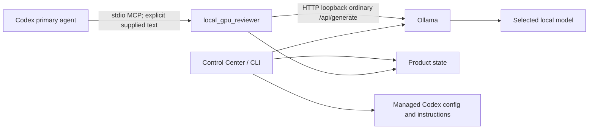

# Architecture

## Components

`ThalenHelper.Core` owns hardware/model/storage decisions, Ollama communication, configuration surgery, state, lifecycle controls, install/repair/update/uninstall, and diagnostics. The CLI and WinForms Control Center are thin interfaces over that core. `ThalenHelper.Mcp` hosts only annotated health/review methods through the official MCP C# SDK.

## Trust boundaries

- Codex decides whether to supply text to the local reviewer.
- Supplied text is untrusted data, not executable instruction.
- Local-model output is untrusted advice.
- The reviewer cannot independently read the repository or use a shell.
- Ollama requests are limited to documented `/api/tags`, `/api/ps`, `/api/generate`, `/api/pull`, and `/api/delete` paths; the reviewer itself uses inventory/runtime/generate only.
- The base URI must be unauthenticated loopback HTTP. Redirects and proxies are disabled. Before sending HTTP bytes, the production transport maps the exact TCP connection to its owning Windows process and requires a current-user, validly signed `Ollama Inc.` `ollama.exe` or `ollama app.exe` peer.
- The MCP server opens no network listener; its only server transport is stdio.

## Resource coordination

A named cross-process semaphore limits helper inference to one request. A named cancellation event lets pause/release operations cancel an active request. Low-impact mode uses short context/output bounds and `keep_alive=0`. Health checks call only inventory/runtime endpoints.

Ollama auto-start uses a separate named cross-process semaphore. It checks a responding endpoint first, then checks existing Ollama processes. It does not spawn a duplicate when an existing process is unhealthy.

## Configuration ownership

The product state JSON records only operational ownership and settings. The MCP table, automatic local GPU guidance, and opt-in reliability baseline use distinct start/end markers. New content is validated before and after atomic write; failures restore the exact original. Uninstall removes only marked content and product-owned state/startup entries.

An existing unmarked `local_gpu_reviewer` table is a separate ownership boundary. Detection enters preservation mode before any Ollama, model-directory, startup, model, or control mutation. Product controls fail closed, and uninstall leaves the existing integration/runtime untouched.

## Compatibility workaround

The server sends ordinary Ollama text generation JSON with `model`, `prompt`, `stream=false`, `think=false`, `keep_alive`, and bounded options. It never constructs a Responses API `agent_message` input item and is not registered as a native Codex custom subagent.
